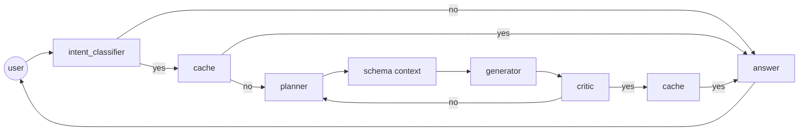

# text-to-sql agent
let user query db using natural language

### agent architecture

```mermaid
flowchart LR
    user((user))
    intent_classifier[intent_classifier]
    cache_in[cache]
    answer[answer]
    planner[planner]
    schema_context[schema context]
    generator[generator]
    critic[critic]
    cache_out[cache]

    user --> intent_classifier
    intent_classifier -- yes --> cache_in
    intent_classifier -- no --> answer

    cache_in -- no --> planner
    cache_in -- yes --> answer

    planner --> schema_context
    schema_context --> generator
    generator --> critic

    critic -- no --> planner
    critic -- yes --> cache_out

    cache_out -- yes --> answer

    answer --> user
```