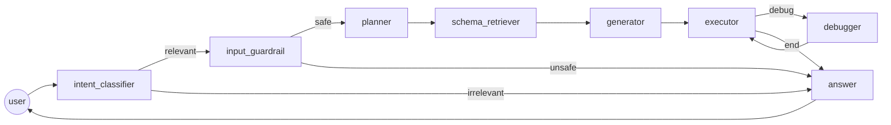

# text-to-sql agent (read-only)
talk to db using natural language

### agent architecture

```mermaid
flowchart LR
    user((user)) --> intent_classifier[intent_classifier]

    intent_classifier -- relevant --> input_guardrail[input_guardrail]
    intent_classifier -- irrelevant --> answer[answer]

    input_guardrail -- safe --> planner[planner]
    input_guardrail -- unsafe --> answer

    planner --> schema_retriever[schema_retriever]
    schema_retriever --> generator[generator]
    generator --> executor[executor]

    executor -- debug --> debugger[debugger]
    executor -- end --> answer
    debugger --> executor

    answer --> user
```